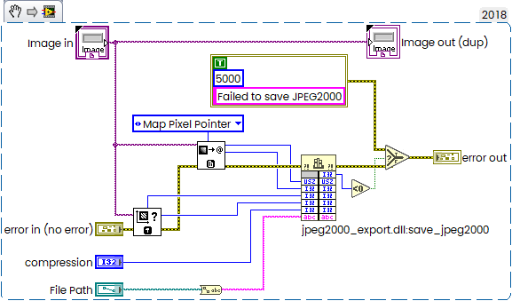
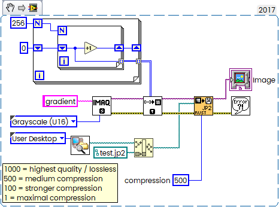

# r-lv-jpeg2000
Rust wrapper for JPEG 2000 image export from LabVIEW.

## Important

Set the OpenCV paths correctly before building:

```
set OPENCV_LINK_PATHS=C:\OpenCV\build\x64\vc16\lib
set OPENCV_INCLUDE_PATHS=C:\OpenCV\build\include
set OPENCV_LINK_LIBS=opencv_world500
set OpenCV_DIR = C:\opencv\build
```

Also add the following directory to your `PATH`:

```
C:\opencv\build\x64\vc16\bin
```

Then rebuild:

```
cargo clean
cargo build --release
```

Build must be started from x64 Native Tools Command Prompt for VS:

```
**********************************************************
** Visual Studio 2026 Developer Command Prompt v18.10.0
** Copyright (c) 2026 Microsoft Corporation
**********************************************************
[vcvarsall.bat] Environment initialized for: 'x64'

C:\Program Files\Microsoft Visual Studio\18\Professional>cd C:\Users\Andrey\Desktop\r-lv-jpeg2000

C:\Users\Andrey\Desktop\r-lv-jpeg2000>cargo build -r
   Compiling jpeg2000_export v0.1.0 (C:\Users\Andrey\Desktop\r-lv-jpeg2000)
    Finished `release` profile [optimized] target(s) in 0.79s
```

Usage:



Example:



This is just a simple example. Error handling is intentionally minimal to keep the code easy to understand.

Compiled jpeg2000_export.dll as well as  opencv_world500.dll in the Release.
